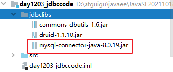
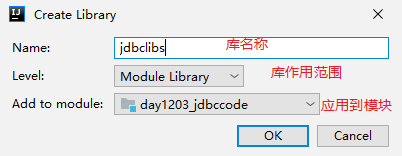
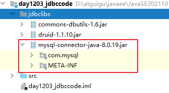
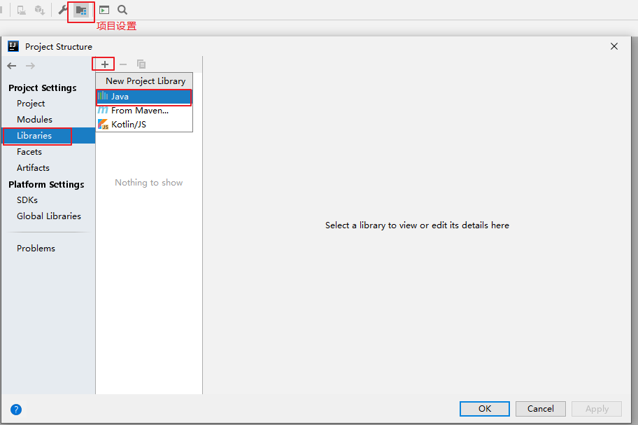
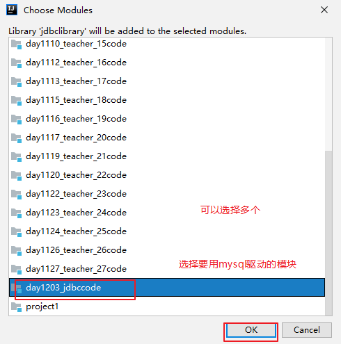
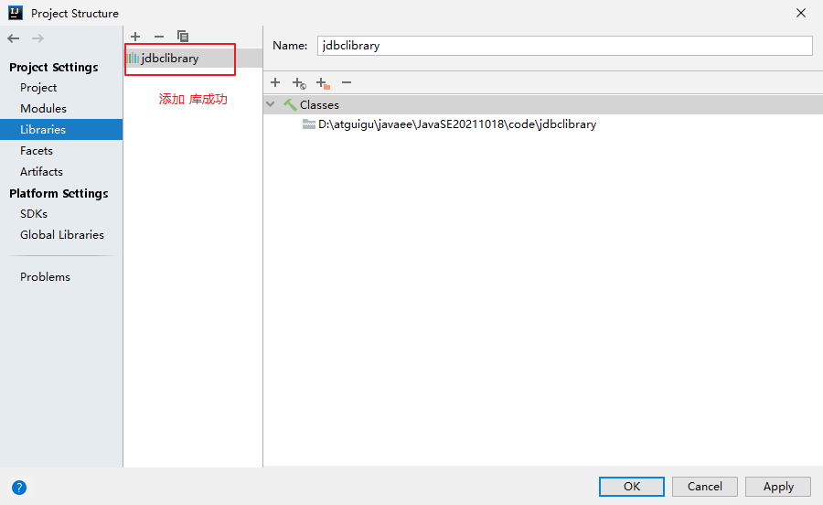
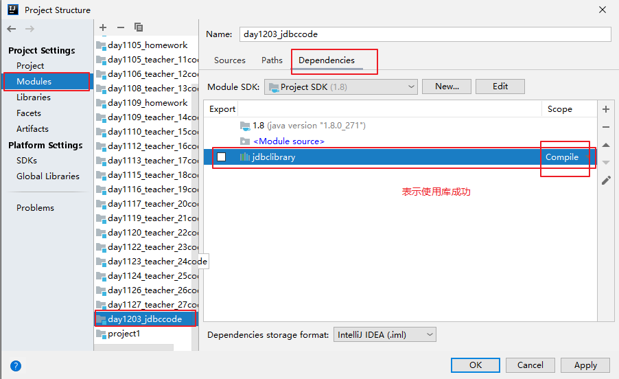
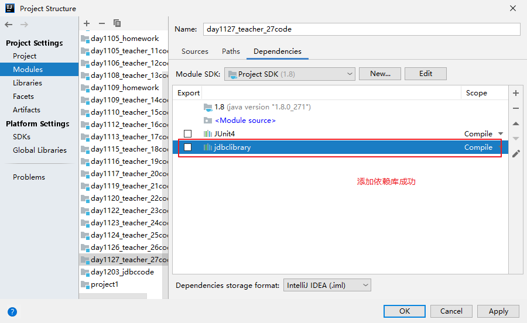

# 第一章  JDBC概述

之前我们学习了JavaSE，编写了Java程序，数据保存在变量、数组、集合等中，无法持久化，后来学习了IO流可以将数据写入文件，但不方便管理数据以及维护数据的关系；

后来我们学习了数据库管理软件MySQL，可以方便的管理数据。

那么如何将它俩结合起来呢？即Java程序<==>MySQL，实现数据的存储和处理。

答案：使用JDBC技术，后期可以使用MyBatis等持久层框架（底层仍然使用了JDBC）。

## 1.1 JDBC概述

JDBC：Java Database Connectivity，==它是代表一组独立于任何数据库管理系统（DBMS）的API==，声明在java.sql与javax.sql包中，是SUN(现在Oracle)提供的一组接口规范。由各个数据库厂商来提供实现类，这些实现类的集合构成了数据库驱动jar。


即JDBC技术包含两个部分：

（1）java.sql包和javax.sql包中的API

（2）各个数据库厂商提供的jar

```java


/*
一、JDBC的概述
1、之前学习了Java，又学习了MySQL数据库
JDBC 把  Java程序 和 MySQL数据库连起来，Java程序是负责数据的输入，业务的处理，数据的显示，MySQL负责数据的存储和管理。

2、JDBC：Java Database Connectivity
JDBC = JDK核心类库中的一套API（接口+部分工具类） + 数据库厂商提供的驱动jar


Java程序不仅仅能够连接MySQL数据库，可以连接很多数据库（Oracle，SQL Server，DB2，...）。
这就有一个问题？
    数据库不同，它们的操作方式会有所不同，因为它们的底层实现方式，实现的语言等都是不同的。
    那么Java去连接不同的数据库时，就会有不同的API。这样的话，就会导致：
    （1）程序员的学习成本增加
    （2）如果发生数据库迁移，Java代码就需要“重写”
    如果是这样的话，就非常麻烦，可移植性、可维护性等非常差。

SUN公司（现在Oracle）就说，必须统一一套API，可以操作各种数据库。但是SUN公司又不同知道所有数据库内部是如何实现的，
也无法要求所有的数据库厂商按照统一的标准来开发他们的数据库软件。
SUN公司（现在Oracle）就设计了一套接口 + 部分类。然后各个数据库厂商，来提供这些接口的实现类。

==>Java程序中面向接口编程，在程序运行时，又需要引入这些接口的实现类，这些实现类就是数据库驱动jar。
```


## 1.2 Java程序连接MySQL数据库

### 1.2.1 引入mysql驱动jar

#### 方式一：单独某个模块使用mysql驱动

```
（1）在模块路径下建一个文件夹“jdbclibs”，把mysql的驱动jar放到里面
MySQL5.7：mysql-connector-java-5.1.36-bin.jar
MySQL8.0：mysql-connector-java-8.0.19.jar
（2）在jdbclibs文件夹上右键-->Add as Library...
（3）填写库名称、选择这个库应用范围（模块）-->选择使用的具体模块
```








#### 方式二：项目下多个模块使用mysql驱动

```
（1）在项目路径下建一个文件夹“jdbclibrary”，把mysql的驱动jar放到里面
mysql-connector-java-5.1.36-bin.jar
MySQL8.0：mysql-connector-java-8.0.19.jar
（2）项目设置-->libraries--> + ->java-->文件夹“jdbclibs”
（3）选择需要这个jar的模块
项目设置-->modules-->模块名-->dependencies--> + - >library->Java -> 库
```











后期其他模块也要使用mysql驱动，可以直接添加项目的jdbclibrary库即可：




#### 方式三：使用Maven仓库

### 12.2.2 Java代码连接MySQL数据库

```java
/*步骤：
1、模块添加了依赖的mysql驱动相关库

2、在内存中加载驱动类（可选）
        最近版本：com.mysql.jdbc.Driver
        MySQL8.0版本：com.mysql.cj.jdbc.Driver
 
  //新版的mysql驱动jar可以省略这步，旧版的mysql驱动jar必须加这一步。
  //后期使用数据库连接池，或者MyBatis等框架时，在配置文件中加这个驱动类的配置即可
 Class.forName("com.mysql.cj.jdbc.Driver"); 

3、连接数据库：通过DriverManager工具类获取数据库连接Connection的对象。
此时的Java程序是MySQL的一个客户端
连接数据库：
     MySQL服务器主机的IP地址：
     端口号
     用户名
     密码

    String url = "jdbc:mysql://localhost:3306/test?serverTimezone=UTC";
    Connection conn = DriverManager.getConnection(url, "root", "123456");
    
    MySQL8使用时，url需要加参数：serverTimezone=UTC，否则会报错：

4、断开连接：使用close方法。
 */
```

## 1.3 实现增删改查

```java
/*步骤：
1、模块添加了依赖的mysql驱动相关库

2、在内存中加载驱动类（可选）
 Class.forName("com.mysql.cj.jdbc.Driver"); 

3、连接数据库
通过DriverManager工具类获取数据库连接Connection的对象。
    String url = "jdbc:mysql://localhost:3306/test?serverTimezone=UTC";
    Connection conn = DriverManager.getConnection(url, "root", "123456");

 4、操作数据库
（1）通过Connection对象获取Statement或PreparedStatement对象
（2）通过Statement或PreparedStatement对象执行sql
执行增、删、改：int executeUpate()
执行查询：ResultSet executeQuery()
（3）如果服务器有查询结果返回，需要用ResultSet接收
遍历结果集的方法：
boolean next()：判断是否还有下一行
getString(字段名或序号),getInt(字段名或序号),getObject(字段名或序号)

5、释放资源（close）
 */
```

### 1.3.1 添加数据

```java

/*
用JDBC实现添加一条记录到atguigu数据库的t_department表中。


步骤：
1、一个项目引入一次数据库驱动jar就可以
2、建立数据库连接
（1）加载驱动类：通过Class类的forName方法注册驱动
（2）获取数据库连接
通过DriverManager类的静态方法获取数据库连接对象
3、通过数据库连接对象获取Statement或PreparedStatement对象，用来执行sql
4、通过Statement或PreparedStatement对象调用
（1）int executeUpdate()：执行insert,update,delete等更新数据库数据的sql

5、关闭，释放各种资源
 */
public class TestInsert {
    public static void main(String[] args)throws Exception {
        //把驱动类加载到内存中
        Class.forName("com.mysql.cj.jdbc.Driver");
        //B：获取数据库连接对象
        String url = "jdbc:mysql://localhost:3306/atguigu?serverTimezone=UTC";
        Connection connection = DriverManager.getConnection(url,"root","123456");
        //Connection   ==> 网络编程的Socket

        String sql = "insert into t_department values(null,'测试数据部门','测试数据部门简介')";//发给服务器的sql
        PreparedStatement pst = connection.prepareStatement(sql);
        //PreparedStatement ==> IO流  网络编程的socket.getOutputStream()发生数据用的
        int len = pst.executeUpdate();
        //返回sql影响的记录数
        System.out.println(len>0 ? "添加成功" : "添加失败");

        pst.close();
        connection.close();

    }
}

```


### 1.3.2 修改数据

```java
......

        String sql = "update t_department set description = 'xx' where did = 7";//发给服务器的sql
        PreparedStatement pst = connection.prepareStatement(sql);
        //PreparedStatement ==> IO流  网络编程的socket.getOutputStream()发生数据用的
......
```


### 1.3.3 删除数据

```java
......
        String sql = "delete from t_department where did = 7";//发给服务器的sql
        PreparedStatement pst = connection.prepareStatement(sql);
        //PreparedStatement ==> IO流  网络编程的socket.getOutputStream()发生数据用的
        int len = pst.executeUpdate();
        //返回sql影响的记录数
        System.out.println(len > 0 ? "删除成功" : "删除失败");
......
```


### 1.3.4 查询数据

```java

/*
步骤：
1、一个项目引入一次数据库驱动jar就可以
2、建立数据库连接
（1）加载驱动类：通过Class类的forName方法注册驱动
（2）获取数据库连接
通过DriverManager类的静态方法获取数据库连接对象
3、通过数据库连接对象获取Statement或PreparedStatement对象，用来执行sql
4、通过Statement或PreparedStatement对象调用
（1）int executeUpdate()：执行insert,update,delete等更新数据库数据的sql
（2）ResultSet executeQuery()：执行select查询的sql，返回一个结果集
（3）boolean execute()：可以用来执行DDL语句


遍历结果集ResultSet的方法：
boolean next()：判断是否还有下一行
getString(字段名或序号),getInt(字段名或序号),getObject(字段名或序号)

5、关闭，释放各种资源
 */
......
    	String sql = "select * from t_department";//发给服务器的sql
        PreparedStatement pst = connection.prepareStatement(sql);
        //PreparedStatement ==> IO流  网络编程的socket.getOutputStream()发生数据用的

        ResultSet resultSet = pst.executeQuery();//==>IO流  输入流，又像是集合和迭代器的集成
        while(resultSet.next()){ //while循环一次，迭代一行，遍历一行
            int did = resultSet.getInt("did");//get一次得到一个单元格的数据
            String dname = resultSet.getString("dname");
            String decription = resultSet.getString("description");
            System.out.println(did +"\t" + dname +"\t" + decription);
        }

        resultSet.close();
        pst.close();
        connection.close();

```


# 第二章 轻松处理各种问题

## 2.1 避免sql拼接问题

### 准备代码和sql

### 问题演示代码


```java


/*
避免sql拼接问题

PreparedStatement接口是Statement接口的子接口的。
Statement接口是不支持 ？ 形式的sql，只能拼接。
 */

        //要给每一个？指定具体的值
        /*
        PreparedStatement支持给每一个字段指定值时，确定数据类型，例如：
        pst.setString(1,ename);
        pst.setDouble(2,salary);
        ...
        但是这样有点麻烦，还要一一去确定数据类型
        PreparedStatement支持用Object统一处理
        pst.setObject(1,ename);
        pst.setObject(2,salary);
         */
        pst.setObject(1,ename);  //这里的1，表示第1个？
        pst.setObject(2,salary);  //这里的2，表示第2个？
        pst.setObject(3,birthday);  //这里的3，表示第3个？
        pst.setObject(4,gender);  //这里的4，表示第4个？
        pst.setObject(5,tel);  //这里的5，表示第5个？
        pst.setObject(6,email);  //这里的6，表示第6个？
        pst.setObject(7,"curdate()");  //这里的7，表示第7个？
        //每一个？与你要赋值的字段对应，不能对错了

        //D：执行sql
        int len = pst.executeUpdate();
        System.out.println(len>0 ? "添加成功" : "添加失败");

        /*
        (1)上面的代码执行出错了：java.sql.SQLException: Data truncated for column 'gender' at row 1
        原因： pst.setObject(4,gender); 把gender自动包装为Character对象
        解决方案：把char类型用String类型表示。

        (2)com.mysql.cj.jdbc.exceptions.MysqlDataTruncation: Data truncation: Incorrect date value: 'curdate()' for column 'hiredate' at row 1
         pst.setObject(7,"curdate()");  "curdate()"代表字符串，setObject把curdate()识别为一个字符串，而不是mysql函数， 这句代码给hiredate字段赋值的是一个String
        hiredate需要的是一个日期。

        解决方案：pst.setObject(7, new Date());
         */

       
```

## 2.2 避免sql注入问题

### 准备代码和sql

### 问题演示代码

```java

/*
避免sql注入问题

演示：从键盘输入员工编号，查询员工信息。每一个员工都可以输入自己的编号，查看自己的信息。
 */
public class TestSQLInject {
    @Test
    public void test01()throws Exception{
        Scanner input = new Scanner(System.in);
        System.out.print("请输入你要查询的员工的编号：");
        String id = input.nextLine();
        // 第一种正常输入：1
        // 第二种恶意输入：1 or 1=1  第一个1表示员工编号， 后面 or 1= 1表示条件，而1=1是永远成立，其他条件全部失效

        //把驱动类加载到内存中
        Class.forName("com.mysql.cj.jdbc.Driver");
        //B：获取数据库连接对象
        String url = "jdbc:mysql://localhost:3306/atguigu?serverTimezone=UTC";
        Connection connection = DriverManager.getConnection(url, "root", "123456");
        //Connection   ==> 网络编程的Socket

        String sql = "select * from t_employee where eid = " + id;
        System.out.println("sql = " + sql);//select * from t_employee where eid = 1 or 1=1
        PreparedStatement pst = connection.prepareStatement(sql);

        //执行查询
        ResultSet rs = pst.executeQuery();
        /*
        ResultSet接口提供了
        (1)boolean next()：判断是否有下一条记录
        (2)获取某个单元格的数据
        String getString(字段名)
        int getInt(字段名)
        double getDouble(字段名)
        ...

        有点麻烦，需要一一去对应字段名
        Object getObject(字段名)
        Object getObject(字段的序号)  从1开始。
         */
        while(rs.next()){//while循环一次，代表一行
            //t_employee有14个字段
            for(int i=1; i<=14; i++){//for循环一次，代表一行中的一个单元格
                System.out.print(rs.getObject(i)+"\t");
            }
            System.out.println();
        }

        rs.close();
        pst.close();
        connection.close();
        input.close();

```


## 2.3 二进制类型数据赋值

### 准备代码和sql

### 问题演示代码

```java


/*
CREATE TABLE `t_user` (
  `id` int(11) NOT NULL AUTO_INCREMENT,
  `username` varchar(20) NOT NULL,
  `password` varchar(50) NOT NULL,
  `photo` blob,
  PRIMARY KEY (`id`)
);

mysql> desc t_user;
+----------+-------------+------+-----+---------+----------------+
| Field    | Type        | Null | Key | Default | Extra          |
+----------+-------------+------+-----+---------+----------------+
| id       | int         | NO   | PRI | NULL    | auto_increment |
| username | varchar(20) | NO   |     | NULL    |                |
| password | varchar(50) | NO   |     | NULL    |                |
| photo    | blob        | YES  |     | NULL    |                |
+----------+-------------+------+-----+---------+----------------+
4 rows in set (0.00 sec)
 */
........

        String sql = "insert into t_user values(null,?,?,?)";
        PreparedStatement pst = connection.prepareStatement(sql);

        //设置？的值
        pst.setObject(1, username);
        pst.setObject(2, password);
//        pst.setObject(3, path);//不对，因为path是一个路径
        pst.setObject(3, new FileInputStream(path)); //用字节IO流来表示二进制数据

        //执行sql
        int len = pst.executeUpdate();
        System.out.println(len >0 ? "添加成功" : "添加失败");

        pst.close();
        connection.close();

        input.close();
/*
当存储的图片特别大时：
（1）com.mysql.cj.jdbc.exceptions.PacketTooBigException: Packet for query is too large (6,638,795 > 4,194,304).
You can change this value on the server by setting the 'max_allowed_packet' variable.
解决方案：修改my.ini配置文件      max_allowed_packet变量的值
先停止服务，然后修改my.ini文件，再重启服务

（2）com.mysql.cj.jdbc.exceptions.MysqlDataTruncation: Data truncation: Data too long for column 'photo' at row 1
问题是：blob类型的数据，存不下这么大的图片
解决方案：修改字段的数据类型
```


## 2.4 获取自增长键值

### 准备代码和sql

### 问题演示代码

```java

/*
获取自增长键值：
mysql中很多表都是有自增长字段，特别是id。
当我们添加了一个员工、部门，添加成功后，需要立刻返回该员工、部门的自增长的id值。

（1）在用Connection数据库连接对象获取PreparedStatement对象时，要加一个参数
PreparedStatement pst = connection.prepareStatement(sql, Statement.RETURN_GENERATED_KEYS);
这里Statement.RETURN_GENERATED_KEYS表示，执行sql后，返回自增长键值

（2）执行完成之后，需要从PreparedStatement对象中获取自增长键值
 ResultSet rs = pst.getGeneratedKeys(); //方法别调错
if(rs.next()){ //因为只有一条记录，所以只有一个自增长键值，用if即可
    System.out.println("新员工编号是：" + rs.getObject(1));//因为自增长键值只有一个，所以这里直接getObject(1)即可
}
 */

```

## 2.5 批处理

### 准备代码和sql问题演示代码

```java

/*
批处理：
    批量执行一组sql。大多数情况下都是批量执行insert语句。

    演示：给部门表批量添加1000条部门测试信息。

MySQL服务器端，默认批处理功能没有开启。需要通过参数告知mysql服务器，开启批处理功能。
在url后面再加一个参数 rewriteBatchedStatements=true

url的格式：
    jdbc:mysql://localhost:3306/atguigu
    如果要加参数，需要用一个?，表示后面是参数

    jdbc:mysql://localhost:3306/atguigu?serverTimezone=UTC

    如果有多个参数，参数之间使用&连接，
    每一个参数都是key=value的格式。

 jdbc:mysql://localhost:3306/atguigu?serverTimezone=UTC&rewriteBatchedStatements=true

 如何实现批处理？
 （1）url中加rewriteBatchedStatements=true
jdbc:mysql://localhost:3306/atguigu?serverTimezone=UTC&rewriteBatchedStatements=true

（2）PreparedStatement对象调用
A：addBatch()
B：executeBatch()
 */

        for(int i=2001; i<=3000; i++){
            //设置1000次？的值
            pst.setObject(1,"测试"+i);
            pst.setObject(2,"测试简介"+i);

//            pst.executeUpdate();//不用设置一次？，就执行一次
            pst.addBatch();//先攒着这些数据，设置完？，sql会重新编译一下，生成一条新的完整的sql
        }
        pst.executeBatch();//最后一口气执行

      ......

```

## 2.6 事务处理

### 准备代码和sql

```mysql
演示：
	update t_department set description = 'xx' where did = 2;
	update t_department set description = 'yy' where did = 3;

	故意把其中一条sql语句写错。

    update t_department set description = 'xx' where did = 2;
	update t_department set description = 'yy' what did = 3;  #what是错误的
```

### 问题演示代码

```java

/*
如果多条sql要组成一个事务，要么一起成功，要么一起失败。
例如：订单
    （1）修改商品表的商品库存和销量
    （2）订单表新建订单数据
    （3）订单明细表新建订单明细记录（多条）
    ....
    这些sql要么一起成功，要么都还原到最初。

演示：
	update t_department set description = 'xx' where did = 2;
	update t_department set description = 'yy' where did = 3;

	故意把其中一条sql语句写错。

    update t_department set description = 'xx' where did = 2;
	update t_department set description = 'yy' what did = 3;  #what是错误的，故意制造错误

JDBC如何管理事务？
（1）mysql默认是自动提交事务，每执行一条语句成功后，自动提交。
需要开启手动提交模式。

Connection连接对象.setAutoCommit(false);//取消自动提交模式，开始手动提交模式

(2)sql执行成功，别忘了提交事务
Connection连接对象.commit();

（3）sql执行失败，回滚事务
Connection连接对象.rollback();
 */
........
        connection.setAutoCommit(false);//取消自动提交模式，开始手动提交模式

        String s1 = "update t_department set description = 'xx' where did = 2";
        String s2 = "update t_department set description = 'yy' what did = 3";

        try(PreparedStatement p1 = connection.prepareStatement(s1);
            PreparedStatement p2 = connection.prepareStatement(s2);) {

            p1.executeUpdate();
            p2.executeUpdate();
            System.out.println("两条更新成功");
            connection.commit();//提交事务
        }catch(SQLException e){
            e.printStackTrace();
            System.out.println("失败");
            connection.rollback();//回滚事务
        }finally {
            connection.close();
        }
    }
}

```

# 第三章 数据库连接池

## 1、什么是数据库连池

连接对象的缓冲区。负责申请，分配管理，释放连接的操作。

## 2、为什么要使用数据库连接池

（1）不使用数据库连接池，每次都通过DriverManager获取新连接，用完直接抛弃断开，连接的利用率太低，太浪费。
（2）对于数据库服务器来说，压力太大了。我们数据库服务器和Java程序对连接数也无法控制，很容易导致数据库服务器崩溃。

我们就希望能管理连接。

- 我们可以建立一个连接池，这个池中可以容纳一定数量的连接对象，一开始，我们可以先替用户先创建好一些连接对象，等用户要拿连接对象时，就直接从池中拿，不用新建了，这样也可以节省时间。然后用户用完后，放回去，别人可以接着用。
- 可以提高连接的使用率。当池中的现有的连接都用完了，那么连接池可以向服务器申请新的连接放到池中。
  直到池中的连接达到“最大连接数”，就不能在申请新的连接了，如果没有拿到连接的用户只能等待。

## 3、市面上有很多现成的数据库连接池技术

* JDBC 的数据库连接池使用 javax.sql.DataSource 来表示，DataSource 只是一个接口（通常被称为数据源），该接口通常由服务器(Weblogic, WebSphere, Tomcat)提供实现，也有一些开源组织提供实现：
  * **DBCP** 是Apache提供的数据库连接池，**速度相对c3p0较快**，但因自身存在BUG，Hibernate3已不再提供支持
  * **C3P0** 是一个开源组织提供的一个数据库连接池，**速度相对较慢，稳定性还可以**
  * **Proxool** 是sourceforge下的一个开源项目数据库连接池，有监控连接池状态的功能，**稳定性较c3p0差一点**
  * **BoneCP** 是一个开源组织提供的数据库连接池，速度快
  * **Druid** 是阿里提供的数据库连接池，据说是集DBCP 、C3P0 、Proxool 优点于一身的数据库连接池

## 4、如何使用德鲁伊数据库连接池

### （1）步骤

```java
(1)引入jar包
    和引入mysql驱动jar方式一样
（2）编写配置文件
    src下加一个druid.properties文件
（3）创建数据库连接池对象
（4）获取连接
```


### （2）druid.properties文件

```java
#key=value
driverClassName=com.mysql.cj.jdbc.Driver
url=jdbc:mysql://localhost:3306/atguigu?serverTimezone=UTC&rewriteBatchedStatements=true
username=root
password=123456
initialSize=5
maxActive=10
maxWait=1000
```


| 配置                          | **缺省** | **说明**                                                     |
| ----------------------------- | -------- | ------------------------------------------------------------ |
| name                          |          | 配置这个属性的意义在于，如果存在多个数据源，监控的时候可以通过名字来区分开来。 如果没有配置，将会生成一个名字，格式是：”DataSource-” + System.identityHashCode(this) |
| jdbcUrl                       |          | 连接数据库的url，不同数据库不一样。例如：mysql : jdbc:mysql://10.20.153.104:3306/druid2 oracle : jdbc:oracle:thin:@10.20.149.85:1521:ocnauto |
| username                      |          | 连接数据库的用户名                                           |
| password                      |          | 连接数据库的密码。如果你不希望密码直接写在配置文件中，可以使用ConfigFilter。详细看这里：<https://github.com/alibaba/druid/wiki/%E4%BD%BF%E7%94%A8ConfigFilter> |
| driverClassName               |          | 根据url自动识别 这一项可配可不配，如果不配置druid会根据url自动识别dbType，然后选择相应的driverClassName(建议配置下) |
| initialSize                   | 0        | 初始化时建立物理连接的个数。初始化发生在显示调用init方法，或者第一次getConnection时 |
| maxActive                     | 8        | 最大连接池数量                                               |
| maxIdle                       | 8        | 已经不再使用，配置了也没效果                                 |
| minIdle                       |          | 最小连接池数量                                               |
| maxWait                       |          | 获取连接时最大等待时间，单位毫秒。配置了maxWait之后，缺省启用公平锁，并发效率会有所下降，如果需要可以通过配置useUnfairLock属性为true使用非公平锁。 |
| poolPreparedStatements        | false    | 是否缓存preparedStatement，也就是PSCache。PSCache对支持游标的数据库性能提升巨大，比如说oracle。在mysql下建议关闭。 |
| maxOpenPreparedStatements     | -1       | 要启用PSCache，必须配置大于0，当大于0时，poolPreparedStatements自动触发修改为true。在Druid中，不会存在Oracle下PSCache占用内存过多的问题，可以把这个数值配置大一些，比如说100 |
| validationQuery               |          | 用来检测连接是否有效的sql，要求是一个查询语句。如果validationQuery为null，testOnBorrow、testOnReturn、testWhileIdle都不会其作用。 |
| testOnBorrow                  | true     | 申请连接时执行validationQuery检测连接是否有效，做了这个配置会降低性能。 |
| testOnReturn                  | false    | 归还连接时执行validationQuery检测连接是否有效，做了这个配置会降低性能 |
| testWhileIdle                 | false    | 建议配置为true，不影响性能，并且保证安全性。申请连接的时候检测，如果空闲时间大于timeBetweenEvictionRunsMillis，执行validationQuery检测连接是否有效。 |
| timeBetweenEvictionRunsMillis |          | 有两个含义： 1)Destroy线程会检测连接的间隔时间2)testWhileIdle的判断依据，详细看testWhileIdle属性的说明 |
| numTestsPerEvictionRun        |          | 不再使用，一个DruidDataSource只支持一个EvictionRun           |
| minEvictableIdleTimeMillis    |          |                                                              |
| connectionInitSqls            |          | 物理连接初始化的时候执行的sql                                |
| exceptionSorter               |          | 根据dbType自动识别 当数据库抛出一些不可恢复的异常时，抛弃连接 |
| filters                       |          | 属性类型是字符串，通过别名的方式配置扩展插件，常用的插件有： 监控统计用的filter:stat日志用的filter:log4j防御sql注入的filter:wall |
| proxyFilters                  |          | 类型是List，如果同时配置了filters和proxyFilters，是组合关系，并非替换关系 |

### （3）使用代码

```java
/*
1、数据库连接池：
    有一个缓冲区，存储一定量的数据库连接对象，
    这个缓冲区会事先准备好一些数据库连接对象，等用户需要时，就从池中拿一个现成的数据库连接对象给用户使用，
    用完之后，返回连接池，其他人下次也可以用。
    当池中的连接对象都被分配出去了，会申请新的数据库连接对象加入，但是也不是无限量申请，
    会有一个上限，如果池中的数据库连接对象的个数到达上限，那么不能在增加了，
    如果此时池中的连接对象都被分配出去了，有新用户要申请连接对象，只能等待或者失败。
2、为什么要用数据库连接池？
（1）Java程序 和 mysql服务器相当于C/S结构的网络应用程序，而且是基于TCP/IP协议的网络应用程序，
每一次Java程序要与mysql服务器通信（执行sql），都需要先建立连接，然后才能通信。
TCP/IP协议（面向连接的可靠的基于字节流的传输控制协议）：要求先三次握手，通过后才能正式建立连接，用完了，还要四次挥手，释放连接。

A：如果这样费劲才建立的连接，执行了一个sql之后，就释放了，太浪费了。
B：每一次建立连接，过程都很麻烦，响应就比较慢
C：如果服务器端没有限制，来一个请求建立连接，mysql服务器就响应，那么mysql服务器会因为需要分配太多的连接，而内存泄漏。

（2）建立连接池的好处：
A：事先准备好一些连接的话，用户来了就分配给它，不用现建立连接，更快。
B：连接用完，放回池中，可以重复利用，连接的利用率增加。
C：池可以限制上限，这样服务器就不会轻易崩溃，更安全。

数据库连接池是在应用程序服务器中，不是mysql服务器中。

3、市面上有很多现成的数据库连接池技术。
JDBC 的数据库连接池使用 javax.sql.DataSource 来表示，DataSource 只是一个接口（通常被称为数据源），
该接口通常由服务器(Weblogic, WebSphere, Tomcat)提供实现，也有一些开源组织提供实现。

Druid：是阿里提供的数据库连接池，据说是集DBCP 、C3P0 、Proxool 优点于一身的数据库连接池

4、如何使用德鲁伊数据库连接池技术
（1）引入jar
A：把druid-1.1.10.jar放到jdbclibs目录下
B：项目设置->modules->当前模块-->dependencies-->选择上面引入过的jdbclibs库，去掉
C：重新选择模块下jdbclibs文件夹->右键->Add as library...
（2）通过配置文件配置相关属性信息
基本：驱动类名、url、用户名、密码、要连接的数据名等，数据库连接池就是用来管理数据库连接，那么必须要有能够建立连接的基本属性
其他：初始化的数据库连接对象的数量、最大的数据库连接对象的数量等
在src下建议 druid.properties

注意，这些属性参数的key不能随意命名，必须和它要求的一样。
driverClassName=com.mysql.cj.jdbc.Driver
url=jdbc:mysql://localhost:3306/atguigu?serverTimezone=UTC&rewriteBatchedStatements=true
username=root
password=123456
initialSize=5  初始化5个连接
maxActive=10   最多10个连接
maxWait=1000    如果10个都分配出去了，新用户等待1000毫秒再看有没有，如果有，获取，没有就报异常

（3）创建数据库连接池对象
工厂模式，通过工厂类的静态方法，创建连接池对象。

（4）获取连接对象

讲解数据库连接池的内容，只是改变了，获取连接的位置和方式，其他代码不变。
 */
public class TestPool {
    public static void main(String[] args)throws Exception {
        Properties pro = new Properties();//这是一个map
        //因为druid.properties文件是在src下，最后会随着.java文件一起编译到类路径下（class）
        //可以通过类加载器帮我们加载资源配置文件
        pro.load(TestPool.class.getClassLoader().getResourceAsStream("druid.properties"));
        DataSource ds = DruidDataSourceFactory.createDataSource(pro);

/*        Connection connection = ds.getConnection();
        System.out.println("connection = " + connection);*/

        //演示获取15个连接对象
        for(int i=1; i<=15; i++){
            //多线程，每一个线程代表一个用户来获取连接
            new Thread(){
                public void run(){
                    try {
                        Connection conn = ds.getConnection();
                        System.out.println(conn);

                        //......增删改查代码，省略

                        //这里没有close方法，说明没有还回去
                        //如果加一句close
                        conn.close();//此时不是断开连接，是还给连接池
                    } catch (SQLException e) {
                        e.printStackTrace();
                    }
                }
            }.start();
        }

    }
}
/*
如果上面线程中没有conn.close()，相当于没有还回去，10个分配完了，就没有了
com.mysql.cj.jdbc.ConnectionImpl@3eed96a1       1
com.mysql.cj.jdbc.ConnectionImpl@15e9413a       2
com.mysql.cj.jdbc.ConnectionImpl@57c61316       3
com.mysql.cj.jdbc.ConnectionImpl@1015657a       4
com.mysql.cj.jdbc.ConnectionImpl@521d5e1e       5
com.mysql.cj.jdbc.ConnectionImpl@58e2511d       6
com.mysql.cj.jdbc.ConnectionImpl@11c7d30        7
com.mysql.cj.jdbc.ConnectionImpl@53791eb8       8
com.mysql.cj.jdbc.ConnectionImpl@48914ff6       9
com.mysql.cj.jdbc.ConnectionImpl@1686f135       10
com.alibaba.druid.pool.GetConnectionTimeoutException: wait millis 1015, active 10, maxActive 10, creating 0

 第11个来拿连接报错，后面没有第12个
 */


/*
如果上面线程中有conn.close()，相当于有还回去，10个连接可以重复使用
com.mysql.cj.jdbc.ConnectionImpl@1accbdbb
com.mysql.cj.jdbc.ConnectionImpl@3b74ade1
com.mysql.cj.jdbc.ConnectionImpl@5901f646
com.mysql.cj.jdbc.ConnectionImpl@15e9413a
com.mysql.cj.jdbc.ConnectionImpl@1015657a
com.mysql.cj.jdbc.ConnectionImpl@5901f646  重复使用1次
com.mysql.cj.jdbc.ConnectionImpl@15e9413a   重复使用1次
com.mysql.cj.jdbc.ConnectionImpl@3b74ade1  重复使用1次
com.mysql.cj.jdbc.ConnectionImpl@1015657a   重复使用1次
com.mysql.cj.jdbc.ConnectionImpl@1accbdbb   重复使用1次
com.mysql.cj.jdbc.ConnectionImpl@5901f646   重复使用2次
com.mysql.cj.jdbc.ConnectionImpl@15e9413a   重复使用2次
com.mysql.cj.jdbc.ConnectionImpl@3b74ade1   重复使用2次
com.mysql.cj.jdbc.ConnectionImpl@1accbdbb   重复使用2次
十二月 03, 2021 2:33:47 下午 com.alibaba.druid.pool.DruidDataSource info
com.mysql.cj.jdbc.ConnectionImpl@1accbdbb
 */
```


